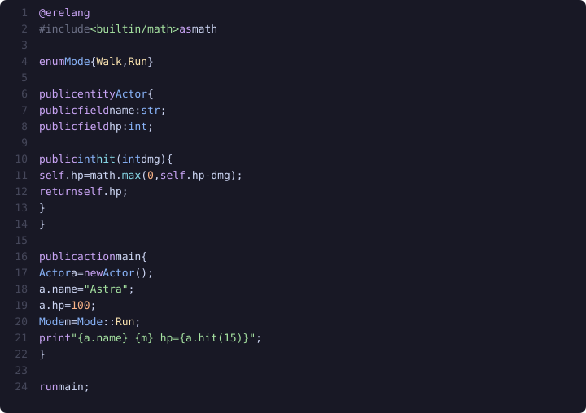
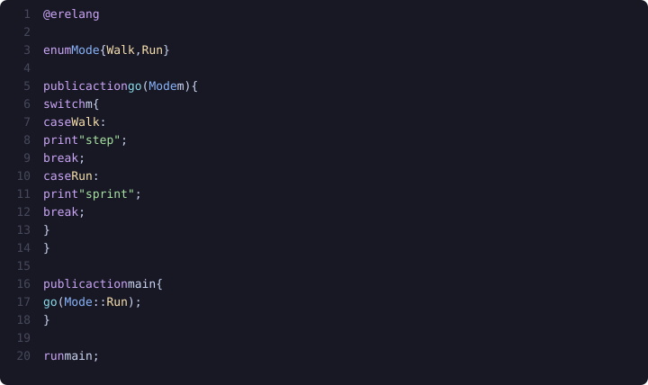
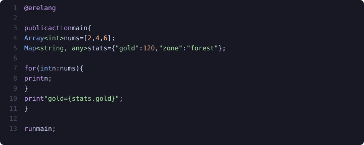
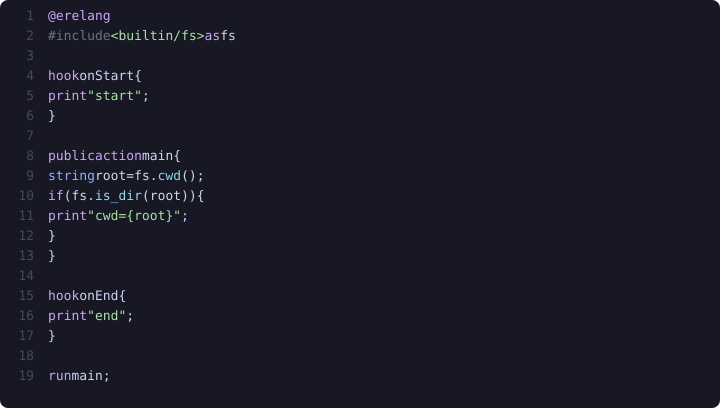
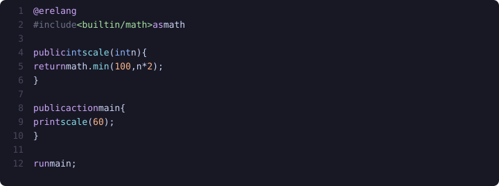

# Erelang

<p align="center">
  
  
  
  
  
  
</p>

Erelang is a scripting language with its own interpreter (`erelang.exe`). You write `.elan` files: actions, entities, enums, hooks, then `run` an entry point. The runtime is C++20 and targets Windows.

It exists because the usual options were a bad fit. Python and JavaScript pull in a whole ecosystem for a few scripts. Embedding Lua or a custom DSL in C++ still meant fighting someone else's syntax and object model. Erelang is the language and the VM in one tree. You can change both.

Scripts stay small on purpose. There is no GUI in the core. Filesystem, network, math, and the rest are `#include` modules, so a hello-world does not load HTTP. Entities and hooks are there for game-shaped programs (objects with methods, work that runs around `main`) without turning the language into C++.

```bash
cmake -S . -B build -DCMAKE_BUILD_TYPE=Debug
cmake --build build --target erelang_runner -j 8
./build/bin/Debug/erelang.exe examples/program.elan
```

`-DERELANG_EXPERIMENTAL=ON` enables `builtin/threads` and `builtin/monitor`.

## Entity



## Switch



## Collections



## Filesystem and hooks



## Include



Docs: [docs/](docs/README.md). Editor: `erevos-language/`. License: [Apache-2.0](LICENSE).
